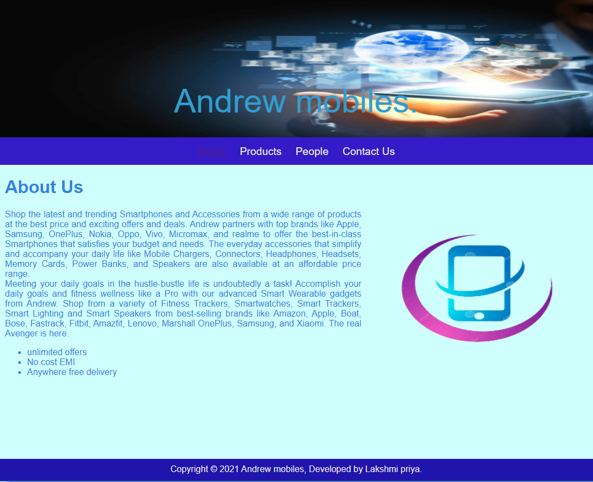
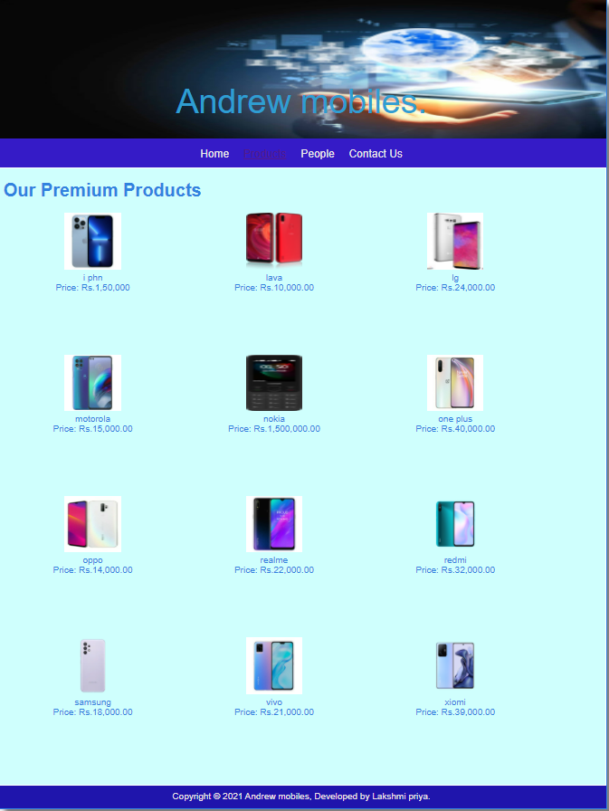
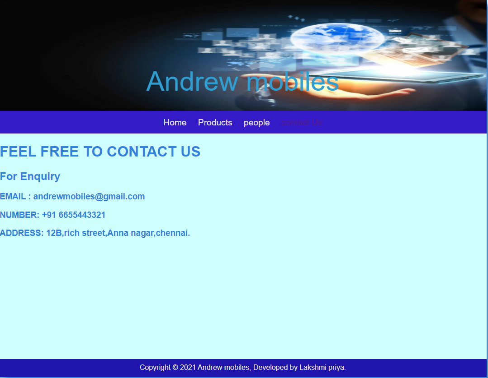

# Web Design for a Software Product Company

## AIM:

To design a static website for a software product company company.

## DESIGN STEPS:

### Step 1:

Requirement collection.

### Step 2:

Creating the layout using HTML and CSS.

### Step 3:

Updating the sample content.

### Step 4:

Choose the appropriate style and color scheme.

### Step 5:

Validate the layout in various browsers.

### Step 6:

Validate the HTML code.

### Step 6:

Publish the website in the given URL.

## PROGRAM :
### homepage :
~~~
<!DOCTYPE html>
<html lang="en">
  <head>
    <title>Andrew mobiles</title>
    <link rel="stylesheet" href="./css/layout.css" />
    <link rel="icon" href="./img/icon.png" type="image/x-icon" />
  </head>

  <body>
    

      
Andrew mobiles.

      

        
<a href="/static/home.html">Home</a>

        
<a href="/static/products.html">Products</a>

        
<a href="/static/people.html">People</a>

        
<a href="/static/contact Us.html">Contact Us</a>

      

      

        

          <h1>About Us</h1>
          
          

            Shop the latest and trending Smartphones and Accessories from a wide
            range of products at the best price and exciting offers
            and deals. Andrew partners with top brands like Apple, Samsung, 
            OnePlus, Nokia, Oppo, Vivo, Micromax, and realme to offer the
            best-in-class Smartphones that satisfies your budget and needs. 
            The everyday accessories that simplify and accompany your daily life like
            Mobile Chargers, Connectors, Headphones, Headsets, Memory Cards, Power Banks, 
            and Speakers are also available at an affordable price range.
             
            Meeting your daily goals in the hustle-bustle life is undoubtedly a task!
            Accomplish your daily goals and fitness wellness like a Pro with our advanced Smart Wearable gadgets from Andrew.
            Shop from a variety of Fitness Trackers, Smartwatches, Smart Trackers, 
            Smart Lighting and Smart Speakers from best-selling brands like
            Amazon, Apple, Boat, Bose, Fastrack, Fitbit, Amazfit, Lenovo, Marshall OnePlus, Samsung, and Xiaomi.
            The real Avenger is here.
            
            <ul>
              <li>unlimited offers</li>
              <li>No cost EMI</li>
              <li>Anywhere free delivery</li>
            </ul>
          

        

      

      

        Copyright &#169; 2021 Andrew mobiles, Developed by Lakshmi priya.
      

    

  </body>
</html>
~~~

### products :
~~~
<!DOCTYPE html>
<html lang="en">
  <head>
    <title>Andrew mobiles</title>
    <link rel="stylesheet" href="./css/layout.css" />
    <link rel="icon" href="./img/icon.png" type="image/x-icon" />
  </head>

  <body>
    

      
Andrew mobiles.

      

        
<a href="/static/home.html">Home</a>

        

          <a href="/static/products.html">Products</a>
        

        
<a href="/static/people.html">People</a>

        
<a href="/static/contact Us.html">Contact Us</a>

      

      

        
    
          <h1>Our Premium Products</h1>
          

              
 
                  

                  
                  

                  
i phn

                  
Price: Rs.1,50,000 

              

              
 
                  

                  
                  

                  
lava

                  
Price: Rs.10,000.00 

              

              
 
                

                
                

                
lg

                
Price: Rs.24,000.00 

              

              
 
                

                
                

                
motorola

                
Price: Rs.15,000.00 

              

              
 
                

                
                

                
nokia

                
Price: Rs.1,500,000.00 

              

              

                

                
                

                
one plus

                
Price: Rs.40,000.00 

              

              
 
                

                
                

                
oppo

                
Price: Rs.14,000.00 

              

              
 
                

                
                

                
realme

                
Price: Rs.22,000.00 

              

              
 
                

                
                

                
redmi

                
Price: Rs.32,000.00 

              

              
 
                

                
                

                
samsung

                
Price: Rs.18,000.00 

              

              
 
                

                
                

                
vivo

                
Price: Rs.21,000.00 

              

              
 
                

                
                

                
xiomi

                
Price: Rs.39,000.00 

              

          

          
        
      

      

        Copyright &#169; 2021 Andrew mobiles, Developed by Lakshmi priya.
      

    

  </body>
</html>
~~~

### people :
~~~
<!DOCTYPE html>
<html lang="en">
    <head>
        <title>Andrew mobiles</title>
        <link rel="stylesheet" href="./css/layout.css" />
        <link rel="icon" href="./img/icon.png" type="image/x-icon" />
    </head>
    <body>
        

            
Andrew mobiles

            

                
<a href="/static/home.html">Home</a>

                
<a href="/static/products.html">Products</a>

                
<a href='/static/people.html'>people</a>

                
<a href='/static/contact Us.html'>contact Us</a>

            

            

                

                    <h1>Our Crew Welcomes You All</h1>
                    

                        

                            

                                
                            

                            
Chief Executive Officer

                            
alexa

                        

                        

                            

                                
                            

                            
Chief Financial Officer

                            
kim

                        

                        

                            

                                
                            

                            
Chief Operating Officer

                            
srisha

                        

                        

                            

                                
                            

                            
Chief Marketing Officer

                            
asifa

                        

                        

                            

                                
                            

                            
Chief Technology Officer

                            
Rohit

                        

                        

                            

                                
                            

                            
President

                            
sahaa

                        

                    

                

            

            

                Copyright &#169; 2021 Andrew mobiles, Developed by Lakshmi priya. 
            

        

    </body>
</html>
~~~

### contact Us :
~~~
<!DOCTYPE html>
<html lang="en">
    <head>
        <title>Andrew mobiles</title>
        <link rel="stylesheet" href="./css/layout.css" />
        <link rel="icon" href="./img/icon.png" type="image/x-icon" />
    </head>

    <body>
        

            
Andrew mobiles

            

                
<a href="/static/home.html">Home</a>

                
<a href="/static/products.html">Products</a>

                
<a href='/static/people.html'>people</a>

                
<a href='/static/contact Us.html'>contact Us</a>

            

            

                

                    <h1>FEEL FREE TO CONTACT US</h1> 
                    

                        <h2>For Enquiry</h2>
                        <h3>EMAIL : andrewmobiles@gmail.com</h3>
                        <h3>NUMBER: +91 6655443321</h3>
                        <h3>ADDRESS: 12B,rich street,Anna nagar,chennai.</h3>
                    

                

            

            

            Copyright &#169; 2021 Andrew mobiles, Developed by Lakshmi priya.
            

        

    </body>
</html>
~~~

### css code :
~~~
* {
  box-sizing: border-box;
  font-family: Arial, Helvetica, sans-serif;
}
body {
  background-color: #f1f1f3;
  color: #3182df;
}
.container {
  width: 1080px;
  margin-left: auto;
  margin-right: auto;
  border-width: 1px 1px 1px 1px;
  border-style: solid;
  box-shadow: 15px 15px 8px gray;
}

.banner {
  display: block;
  width: 100%;
  height: 250px;
  text-align: center;
  font-size: 60px;
  background-image: url("/static/img/image.JPG");
  background-size: 100% 100%;
  margin: 0px 0px 0px 0px;
  padding-top: 150px;
  color: #2f9ed1;
}

.menu {
  display: block;
  width: 100%;
  height: 50px;
  font-size: larger;
  background-color: #351bc7;
  text-align: center;
  padding-top: 15px;
  margin: 0px 0px 0px 0px;
  border-width: 1px;
}

.menuitem {
  display: inline-block;
  margin-left: 10px;
  margin-right: 10px;
}
.menuitemselected {
  display: inline-block;
  margin-left: 10px;
  margin-right: 10px;
  color: #3eb4d8;
}

.menuitem a {
  text-decoration: none;
  color: #e9e7e7;
}

.content {
  display: block;
  width: 100%;
  background-color: #cffffd;
  min-height: 500px;
  margin: 0px 0px 0px 0px;
  border-width: 1px;
  border-color: white;
  border-style: solid;
}
.homecontent {
  min-height: 500px;
  margin: 10px 10px 10px 10px;
}
.homecontent h1 {
  text-align: left;
}
.homecontent img {
  float: right;
  width: 400px;
  height: 300px;
  margin-left: 10px;
}

.contenttext {
  text-align: justify;
}

.productcontent {
  min-height: 500px;
  margin: 10px 10px 10px 10px;
}

.productcontent h1 {
  text-align: left;
}

.productitems {
  display: block;
}

.productitem {
  display: inline-block;
  width: 30%;
  height: 250px;
  text-align: center;
}

.productitem img {
  width: 100px;
  height: 100px;
  display: block;
}
.productitem .itemimage {
  display: block;
  margin-left: auto;
  margin-right: auto;
  width: 100px;
  margin-bottom: 5px;
}

.productitem .itemname {
  display: block;
}
.productitem .itemprice {
  display: block;
}

.footer {
  display: block;
  width: 100%;
  height: 40px;
  background-color: #1f15ac;
  text-align: center;
  padding-top: 10px;
  margin: 0px 0px 0px 0px;
  color: #ece5e5;
}
~~~

## OUTPUT:

### Home Page:

### products :

### people :

### contact us :

## Result:

Thus a website is designed for the software product company and the HTML,CSS code are validated.
